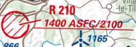

|imgOpenair100| |imgOpenair101| |imgOpenairBeta|

`Openair`_ Format - Open Airspace and terrain description language
===================
Un format ouvert pour l'encodage de données aéronautiques.

**Table of Contents**

.. contents::
   :backlinks: none
   :local:

Description
-----------
Un format ouvert pour l'encodage de données aéronautiques ; basé sur un format de fichier TEXTE (TEXT-file format) ; optimisé et utilisé par de nombreux logiciels.

Le format **OpenAir** a pris naissance dans les années 1990. Depuis 30 ans maintenant, ce langage perdure car il est utilisé par de nombreux outils cartographique ou appreils de géolocalisation de type GPS.
De nos jours; le besoin des pilotes a évolué. L'information aéronautique s'est grandement digitalisée et les capcités informatique mis à disposition des pilotes n'a cessé de progresser.
Il est donc temps de faire évoluer ce format historique afin de répondre aux nouveaux enjeux ciblés !

Depuis septembre 2019 ; `Pascal Bazile`_ s'attache à compléter se formalisme pour étendre ses capacités et y ajouter de nombreuses informations utiles à tous les piloltes...
Vous trouverez ci-dessous ; l'historique des évolutions ainsi que la description détaillée de ce formalisme `Openair`_

Exemples de contenus dans la version initiale |imgOpenair100|
~~~~~~~~~~~~~~~~~~~~~~~~~~~~~~~~~~~~~~~~~~~~~~~~~~~~~~~~
	.. code::
	
		*** Tracé d'un rectangle, coordonnées précisées avec une taille-fixe
		AC D
		AN ORLEANS 5.1
		AH FL065
		AL 3500FT AMSL
		DP 47:52:20 N 002:01:57 E
		DP 47:42:12 N 002:06:19 E
		DP 47:36:24 N 001:56:51 E
		DP 47:44:30 N 001:32:30 E
		DP 47:52:20 N 002:01:57 E

		*** Tracé d'un cercle, coordonnées précisées avec une taille-fixe
		AC P
		AN Luxeuil
		AH 500FT AGL
		AL SFC
		V X=47:47:20 N 006:21:20 E
		DC 1.1

		*** Autre cercle (ici uniquement présenté pour démontrer les évolutions de formalisme précisées plus bas...)
		AC R
		AN 210
		AH 2100FT AMSL
		AL SFC
		V X=49:37:00 N 004:34:50 E
		DC 0.81

		*** Tracé contenant Arc-horaire et Arc-AntiHoraire, coordonnées précisées avec une taille-fixe
		AC D
		AN MONTPELLIER 2
		AH FL145
		AL 2000FT AMSL
		DP 43:29:20 N 003:50:39 E
		DP 43:34:12 N 003:43:40 E
		DP 43:38:27 N 003:39:40 E
		V X=43:34:49 N 003:58:16 E
		V D=+
		DB 43:38:27 N 003:39:40 E, 43:45:15 N 003:45:24 E
		DP 43:45:15 N 003:45:24 E
		DP 43:45:45 N 003:59:56 E
		DP 43:40:10 N 004:06:40 E
		V X=43:34:49 N 003:58:16 E
		V D=-
		DB 43:40:10 N 004:06:40 E, 43:29:20 N 003:50:39 E
		DP 43:29:20 N 003:50:39 E

Exemples des mêmes contenus dans la nouvelle version |imgOpenairBeta|
~~~~~~~~~~~~~~~~~~~~~~~~~~~~~~~~~~~~~~~~~~~~~~~~~~~~~~~~~~~~~~~~~~~~~
	.. code::
	
		*** Tracé d'un rectangle, taille des coordonnées optimisée + ajout des nouvelles informations (volontairement positionnées en commentaire ('*' en entête) afin d'assurer une 'compatibilité ascendante' pour les anciens-outillages...)
		AC D
		AN TMA ORLEANS 5.1 App(123.300) (FFVP-Prot)
		*AAlt ["3500FT AMSL/FL065", "1066m/1981m"]
		*AUID GUId=LFOJ5.1 UId=1563043 Id=LFOJ5.1
		*ADescr OAT/GAT procedures. Activity known on RAI 122.7, PARIS ACC/FIC or SEINE SIV. Except for: -LF-R 243 when active. - LF-P 34 SAINT LAURENT DES EAUX: entry prohibited, exception see AIP ENR 5.1
		*AMhz {"APP": ["123.300*", "Freq veillée/Monitored frequency"], "APP1": ["122.700*", "Freq veillée.RAI/Monitored frequency.Automatical information transmitter"], "TWR": ["121.500*", "Freq veillée/Monitored frequency"], "TWR1": ["124.800*", "Freq veillée/Monitored frequency"], "TWR2": ["122.100*", "Freq veillée/Monitored frequency"]}
		*AActiv [HX] (Pascal Bazile: Voir protocole https://federation.ffvl.fr/sites/ffvl.fr/files/Protocole_Orleans_2015-BA123.pdf) - Activable H24. Possible activation H24
		*ADecla Yes
		AH FL065
		AL 3500FT AMSL
		DP 47:52:20N 2:1:57E
		DP 47:42:12N 2:6:19E
		DP 47:36:24N 1:56:51E
		DP 47:44:30N 1:32:30E
		DP 47:52:20N 2:1:57E

		*** Tracé d'un cercle, taille des coordonnées optimisée + ajout des nouvelles informations
		AC P
		AN ZIT Luxeuil
		*AAlt ["SFC/500FT AGL", "0m/429m"]
		*AUID GUId=ZITLUXEUIL UId=BPa-FR-SIA-SUPAIP-2020-069-ZITLUXEUIL-ZIT Id=ZITLUXEUIL
		*ADescr (Pascal Bazile 15/01/2021 - Source SIA lf_sup_2020_069_fr.pdf) Interdiction de survol d’installations défense spécifiques
		*AActiv [TIMSH] (BPa: Activable du 01/01/2021 au 21/04/2021) Zone interdite temporaire active du 07/05/2020 au 21/04/2021
		*ATimes {"1": ["UTCW(01/01->21/04)", "ANY(00:00->23:59)"]}
		AH 500FT AGL
		AL SFC
		V X=47:47:20N 6:21:20E
		DC 1.1

		*** Autre cercle, avec précision d'une double référence altimétrique (ici un double Plafond) + précision de la non-activation les: Samedis/SATerday, Dimanches/SUNday et JoursFériés/HOLiday
		AC R
		AN R 210 Upper(2100FT AMSL-1400FT AGL)
		*AAlt ["SFC/2100FT AMSL-1400FT AGL", "0m/640m"]
		*AUID GUId=LFR210 UId=1564645 Id=LFR210
		*ADescr GAT IFR and VFR, OAT: avoidance mandatory Administrator: 3ème régiment de génie: 03 24 41 34 33 or 34 12.
		*AActiv [TIMSH] MON-FRI except HOL: Possible activation from SR- 30 to SS+30
		*ATimes {"1": ["UTC(01/01->31/12)", "WD(SR/30/E->SS/30/L)"]}
		*AExSAT Yes
		*AExSUN Yes
		*AExHOL Yes
		AH 2100FT AMSL
		*AH2 1400FT AGL
		AL SFC
		V X=49:37:0N 4:34:50E
		DC 0.81

		*** Tracé contenant arc-horaire et arc-antiHoraire, taille des coordonnées optimisée + ajout des nouvelles informations
		AC D
		AN TMA MONTPELLIER 2 App(130.855)
		*AAlt ["2000FT AMSL/FL145", "609m/4419m"]
		*AUID GUId=LFMT2 UId=1566551 Id=LFMT2
		*ADescr Portions of this airspace coexist with LF- R 108 E1, 108 E2 and 108 C ISTRES, whose entry conditions are stated in part ENR 5.1.
		*AMhz {"APP": ["130.855", "- TMA Montpellier parties 7, 8, 9 et de 14 à 23 / TMA Montpellier parts 7, 8, 9 and from 14 to 23.# - Volumes des TMA 3, 4 et 5 inclus dans le SIV Montpellier partie 5 / Volumes of TMA 3, 4 and 5 included in FIS Montpellier part 5."], "APP1": ["120.375"], "APP2": ["131.055", "- TMA Montpellier parties 1, 2, 3.1, 4, 4.1, 6, 6.1 et de 10 à 13 / TMA Montpellier parts 1, 2, 3.1, 4, 4.1, 6, 6.1 and from 10 to 13#- Volumes des TMA Montpellier parties 3, 4, 5 inclus dans le SIV Montpellier partie 1 / Volumes of TMA Montpellier parts 3, 4, 5 included in FIS Montpellier part 1"], "APP3": ["127.280"], "TWR": ["118.200"], "TWR1": ["118.775"], "FIS": ["134.375", "SIV 1 et/and 2."], "FIS1": ["125.650", "SIV 3, 4 et/and 4.1."], "ATIS": ["124.130", "TEL ATIS: 04 67 13 11 70", "0467131170"]}
		*AActiv [H24]
		AH FL145
		AL 2000FT AMSL
		DP 43:29:2N 3:50:39E
		DP 43:34:12N 3:43:4E
		DP 43:38:27N 3:39:40E
		V X=43:34:49N 3:58:16E
		V D=+
		DB 43:38:27N 3:39:40E, 43:45:15N 3:45:24E
		DP 43:45:15N 3:45:24E
		DP 43:45:45N 3:59:56E
		DP 43:40:1N 4:6:40E
		V X=43:34:49N 3:58:16E
		V D=-
		DB 43:40:1N 4:6:40E, 43:29:2N 3:50:39E
		DP 43:29:2N 3:50:39E

Documentation
-------------

`Openair Standard`_ - Version initiale |imgOpenair100|
~~~~~~~~~~~~~~~~~~~~~~~~~~~~~~~~~~~~~~~~~~~~~~~~~~~~~~

`Openair v1.0.1`_ - Une première extension du formalisme |imgOpenair101|
~~~~~~~~~~~~~~~~~~~~~~~~~~~~~~~~~~~~~~~~~~~~~~~~~~~~~~~~~~~~~~~~~~~~~

`Openair Extended`_ - Version actuelle étandue avec historique des évolutions |imgOpenairBeta|
~~~~~~~~~~~~~~~~~~~~~~~~~~~~~~~~~~~~~~~~~~~~~~~~~~~~~~~~~~~~~~~~~~~~~~~~~~~~~~~~~~~~~~~~~~~~~~
* **AC - Airspace Class** - Classification des zones aériennes
	1. |imgOpenair100| Liste initiale ['A'=Class A, 'B'=Class B, 'C'=Class C, 'D'=Class D, 'E'=Class E, 'G'=Class G, 'CTR'=Control-Traffic-Region, 'P'=Prohibited, 'R'=Restricted, 'Q'=danger, 'GP'=Glider-Prohibited, 'W'=Wave-Window, <Others>=Autres-classification]
	2. |imgOpenair101| Liste complétée par ['NOTAM'=NOtice-To-AirMan, 'NOTAM ref'=NOTAM-référence]
	3. |imgOpenairBeta| Liste complétée par ['TMZ'=Transponder-Mandatory-Zone, 'RMZ'=Radio-Mandatory-Zone, 'ZSM'=Zone-Sensibilité-Majeur, 'FFVL'=FFVL-Protocole-for-PARAGLIDER, 'FFVP'=FFVP-Protocole-for-GLIDER, 'SIV'=Service-d'Information-en-Vol, "RAS"=Regulated-AirSpace, 'ADIZ'=Air-Defense-Identification-Zone, 'AMA'=Minimum-Altitude-Area, 'PART'=PART-of-airspace, 'FIR'=Flight-Information-Region, 'UIR'=Upper-Flight-Information-Region, "OCA"=Oceanic-Control-Area, 'POLITICAL'=Political-administrative-area, "NO-FIR"=Airspace-for-which-not-even-an-FIR-is-defined]

* **AN - Airspace Name** - Libellé de la zone aérienne
	1. |imgOpenair100| Texte libre, sans limitation de taille [mais limité à 16 caractères pour un export sous (Flytec)FAF-format]
	2. |imgOpenair101| Texte libre, ou multi-structuré dans le cas d'une classe 'AC NOTAM'
		**AN NOTAM NOTAM-reference 'Full-type' 'Shorter-type' 'Yet-shorter-type' 'Shortest-type' 'Start-time' 'End-time' 'Schedule' 'Text'**
			- the literal text 'NOTAM'
			- the NOTAM reference
			- **'Full-type'** - The full NOTAM type
			- **'Shorter-type'** - A shorter NOTAM type restricted to 40 characters
			- **'Yet-shorter-type'** - A yet shorter NOTAM type restricted to 25 characters
			- **'Shortest-type'** - The shortest NOTAM type, restricted to 16 characters
			- **'Start-time'** - The NOTAM start
			- **'End-time'** - The NOTAM end
			- **'Schedule'** - The NOTAM schedule
			- **'Text'** - The NOTAM text
		.. code::
		
			*** Here's an example of a NOTAM exported to XCSoar:
			AC NOTAM
			AN NOTAM Air display 16Aug 12:30-16Aug 14:00 H3901/15 AIR DISPLAY/AEROBATICS WI 2NM RADIUS 511918N 0000431E (VCY BIGGIN HILL, KENT). OPS CTC 07803 713470. 15-08-0337/AS4.
			AL SFC
			AH 2400ALT
			V X=51:19:18 N 000:04:31 E
			DC 2

	3. |imgOpenairBeta| Texte libre, ou multi-structuré:
		**AN 'Type' Nom-de-la-zone ['TypeMhz'(Freq-Principale)] [(['CodeActivity'] / [SeeNOTAM])] [Upper(Alt1/Alt2) et/ou Lower(Alt1/Alt2)]**
			- **'Type'** - Typage de la zone : parmis la liste ['TMA'=Terminal-Manoeuvring-Area, 'CTR'=Control-Traffic-Region, 'RTBA'=Reseau-Tres-Basse-Altitude, 'ZIT'=Zone-Interdite-Temporaire, 'TRA'=Temporary-Reserved-Area, 'TSA'=Temporary-Segregated-Area, 'CTA'=ConTrol-Area, 'CBA'=Cross-Boerder-Area, 'LTA'=Lower-Trafic-Area, 'PROTECT'=Airspace-protected-from-specific-air-traffic, 'NATURE'=Natural-reserve, 'FFVL-Prot'=FFVL-Protocole, 'FFVP-Prot'=FFVP-Protocole, 'SPORT'=Aerial-sporting, 'TRPLA'=Treuil-Planeurs, 'TRVL'=Treuil-Vol-Libre, 'PJE'=Parachute-Jumping-Exercise, 'BAL'('BALLOON','BALLOONING')=hot-air-BALloons, 'AER'Radio-controlled-model-flying, 'PRN'=Police-rescue-activity-or-nature-reserve-management-operations, 'ATZ'=Aerodrome-Traffic-Zone, 'AWY'=Airway, 'FIS'=Flight-Information-Service, 'UTA'=Upper-Control-Area]
			- **'TypeMhz'** - Typage de la fréquence-radio-principale qui est affichée : parmis la liste ['App'=Approche, 'Twr'=Tower, 'FIS'=Flight-Information-Service, 'AFIS'=Automatic-Fligth-Information-Service, 'ATIS'=Automatic-Terminal-Information-Service, ...]
			- **'CodeActivity'** - Codification de l'activité de la zone : parmis la liste [PARAGLIDER, HANGGLIDER, GLIDER, PARACHUTE, ULM, NATURE, NO-NOISE, FIRE, GAZ, HI-RADIO, IND-CHEM, IND-NUCLEAR, IND-OIL, JETCLIMB, LASER, MILOPS, MISSILES, NAVAL,  PROCEDURE, REFUEL, SHOOT, SPORT, TECHNICAL, TFC-AD, TFC-HELI, TRG, UAV, VIP, VIP-PRES, WORK, OTHER]
			- **'SeeNOTAM'** - Affichage de l'information contenue dans le nouveau tag '*ASeeNOTAM' (décrit plus bas...)
			- **'Upper'** (Ceiling) - Affichage optionnel de la double-référence-altimétrique du plafond de la zone
			- **'Lower'** (Floor) - Affichage optionnel de la double-référence-altimétrique du plancher de la zone 
		.. code::
		
			*** Quelques exemples
			- AN R KOKSIJDE (MILOPS)
			- AN R KOKSIJDE (MILOPS)
			- AN RMZ MORLAIX Twr(118.500)
			- AN ZRT A400M Twr(124.800) (SeeNotam)
			- AN TMA ETAIN 1 App(120.125) (SeeNotam)
			- AN FFVL-Prot LE TOUQUET Twr(118.450) (PARAGLIDER)
			- AN CTR CHAMBERY 1 Twr(118.300) Upper(3500FT AMSL-1000FT AGL)
			- AN TMA CHAMBERY 1 App(123.700) (SeeNotam) Lower(1000FT AGL-3000FT AMSL)

* **\*AH2 - Second Airspace Ceiling** - Seconde altitude du plafond de la zone
	* |imgOpenairBeta| Cette information est exclusivement présente dans le cas d'une zone décrite avec un double-référence-altimétrique...
	Présentation officielle OACI: |imgLFLB1-doubleRefAltiUpper| ou |imgLFR210-doubleRefAltiUpper|
		.. code::
		
			*** Exemple concret
			AC R
			AN R 210 Upper(2100FT AMSL-1400FT AGL)
			*AAlt ["SFC/2100FT AMSL-1400FT AGL", "0m/640m"]
			AH 2100FT AMSL
			*AH2 1400FT AGL
			AL SFC
			V X=49:37:0N 4:34:50E
			DC 0.81

Official Data or Map
--------------------
* `Paragliding OpenAir French Files`_ - The single source of aeronautical information

Crédit
------
* `Pascal Bazile`_ main developer of `Paragliding OpenAir French Files`_

.. |imgOpenair100| image:: res/openair_v1.0.0.svg
	:target: `Openair Standard`_
	:alt: `OpenAir`_ 1.0.0
.. |imgOpenair101| image:: res/openair_v1.0.1.svg
	:target: `Openair v1.0.1`_
	:alt: `OpenAir`_ v1.0.1
.. |imgOpenairBeta| image:: res/openair_betaVersion.svg
	:target: `Openair`_
	:alt: `Openair`_ beta

.. _Pascal Bazile: https://github.com/BPascal-91/
.. _Paragliding OpenAir French Files: http://pascal.bazile.free.fr/paraglidingFolder/divers/GPS/OpenAir-Format/

.. _Openair: `Openair (on GitHub)`_
.. _Openair Extended: `Openair (on GitHub)`_
.. _Openair (on GitHub): https://github.com/BPascal-91/eAirspacesFormats/tree/master/openair/#readme
.. _Openair v1.0.1: https://notaminfo.com/exporthelp#stdopenair
.. _Openair Standard: http://www.winpilot.com/UsersGuide/UserAirspace.asp

